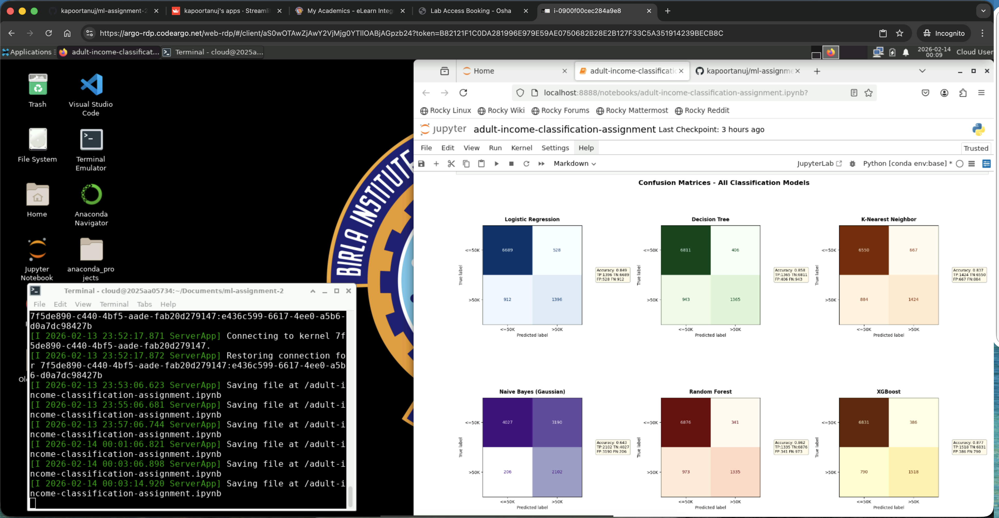

# Machine Learning Assignment 2 - Adult Income Classification

**Binary Classification with Multiple ML Models**

**Name:** Tanuj Kapoor  
**ID:** 2025AA05734  
**Submission Date:** 15/02/2026

---

# Submission Information

## 1. GitHub Repository Link

**Repository URL:** [https://github.com/kapoortanuj/ml-assignment-2/tree/main](https://github.com/kapoortanuj/ml-assignment-2/tree/main)

## 2. Live Streamlit App Link

**Deployed Application:** [https://ml-assignment-2-rt5yyumfo2hj4tmhbnjukd.streamlit.app/](https://ml-assignment-2-rt5yyumfo2hj4tmhbnjukd.streamlit.app/)

## 3. Screenshot - BITS Virtual Lab Execution

# 4. GitHub README Documentation

Below is the complete README.md content from the GitHub repository:

## Adult Income Classification - Machine Learning Project

### Problem Statement

The objective of this project is to predict whether an individual's annual income exceeds $50,000 based on census data. This is a **binary classification problem** where we aim to classify individuals into two categories:
- **Income ≤ $50K** (Class-0)
- **Income > $50K** (Class-1)

This prediction task has practical applications in:
- Credit risk assessment
- Marketing campaigns
- Research

The challenge lies in building robust machine learning models that can accurately classify with imbalanced class distributions and categorical variables.

---

### Dataset Description

**Source:** UCI Machine Learning Repository - Adult Income (Census Income) Dataset

#### Dataset Overview
- **Total Samples:** ~48,000 (after cleaning)
- **Features:** 14 mixed attributes
- **Target Variable:** Income (≤50K or >50K)
- **Train-Test Split:** 80-20 with stratification
- **Class Distribution:**  (imbalanced dataset)
  - Income ≤50K: ~75%
  - Income >50K: ~25%

#### Features
| Feature | Description | Range |
|---------|-------------|-------|
| `age` | Age in years | 17-90 |
| `fnlwgt` | Final weight (census sampling weight) | 10K-1.5M |
| `education-num` | Years of education | 1-16 |
| `capital-gain` | Capital gains | 0-100K |
| `capital-loss` | Capital losses | 0-5K |
| `hours-per-week` | Hours worked per week | 1-99 |
| `workclass` | Type of employment | Private, Self-emp-not-inc, Self-emp-inc, Federal-gov, Local-gov, State-gov, Without-pay, Never-worked |
| `education` | Highest education level | Bachelors, Some-college, 11th, HS-grad, Prof-school, Assoc-acdm, Assoc-voc, 9th, 7th-8th, 12th, Masters, 1st-4th, 10th, Doctorate, 5th-6th, Preschool |
| `marital-status` | Marital status | Married-civ-spouse, Divorced, Never-married, Separated, Widowed, Married-spouse-absent, Married-AF-spouse |
| `occupation` | Job category | Tech-support, Craft-repair, Other-service, Sales, Exec-managerial, Prof-specialty, Handlers-cleaners, Machine-op-inspct, Adm-clerical, Farming-fishing, Transport-moving, Priv-house-serv, Protective-serv, Armed-Forces |
| `relationship` | Family relationship | Wife, Own-child, Husband, Not-in-family, Other-relative, Unmarried |
| `race` | Race category | White, Asian-Pac-Islander, Amer-Indian-Eskimo, Other, Black |
| `sex` | Gender | Male, Female |
| `native-country` | Country of origin | United-States, Cambodia, England, Puerto-Rico, Canada, Germany, India, Japan, etc. |

---

### Models Used

This project implements and compares 6 machine learning classification models with hyperparameter tuning:

1. **Logistic Regression** - Linear baseline model with L2 regularization
2. **Decision Tree Classifier** - Non-linear tree-based model with pruning
3. **K-Nearest Neighbors (kNN)** - Instance-based learning algorithm
4. **Naive Bayes (Gaussian)** - Probabilistic classifier based on Bayes' theorem
5. **Random Forest (Ensemble)** - Bagging ensemble of decision trees
6. **XGBoost (Ensemble)** - Gradient boosting ensemble with regularization

### Hyperparameter Tuning
- **Method:** GridSearchCV with 3-fold cross-validation
- **Scoring Metric:** ROC-AUC for optimal class discrimination
- **Optimization:** All models tuned to maximize generalization performance

---

### Model Performance Comparison

#### Evaluation Metrics Table

| ML Model Name | Accuracy | AUC | Precision | Recall | F1 Score | MCC |
|--------------|----------|-----|-----------|--------|----------|-----|
| **Logistic Regression** | 0.8488 | 0.9032 | 0.7256 | 0.6049 | 0.6597 | 0.5674 |
| **Decision Tree** | 0.8584 | 0.9032 | 0.7708 | 0.5914 | 0.6693 | 0.5894 |
| **kNN** | 0.8372 | 0.8825 | 0.6810 | 0.6170 | 0.6474 | 0.5430 |
| **Naive Bayes** | 0.6435 | 0.8492 | 0.3972 | 0.9107 | 0.5532 | 0.4042 |
| **Random Forest (Ensemble)** | 0.8620 | 0.9141 | 0.7965 | 0.5784 | 0.6702 | 0.5977 |
| **XGBoost (Ensemble)** | **0.8765** | **0.9308** | **0.7973** | **0.6577** | **0.7208** | **0.6474** |

**Key Performance Highlights:**
- **Best Overall Model:** XGBoost (Ensemble)
- **Highest Accuracy:** XGBoost (87.65%)
- **Best AUC Score:** XGBoost (0.9308)
- **Best F1 Score:** XGBoost (0.7208)
- **Best MCC:** XGBoost (0.6474)

---

### Model Performance Observations

| ML Model Name | Observation about Model Performance |
|--------------|-------------------------------------|
| **Logistic Regression** | Strong baseline model with good interpretability. Achieved 84.9% accuracy with balanced precision-recall trade-off. L2 regularization prevents overfitting. The model shows stable performance with fast training time (9 seconds). AUC of 0.903 indicates excellent class discrimination capability. Best suited when model transparency is required. |
| **Decision Tree** | Improved performance over logistic regression (85.8% accuracy) through hyperparameter tuning. Max depth and min samples parameters effectively control overfitting. Precision of 0.771 shows good capability in identifying high-income individuals. However, recall of 0.591 suggests conservative predictions. The tree structure provides clear decision rules but may overfit without proper pruning. |
| **kNN** | Moderate performance (83.7% accuracy) with the advantage of being a non-parametric method. Trained on 70% subset to reduce model size while maintaining competitive results. Distance-weighted neighbors improved predictions for boundary cases. However, the model shows lower AUC (0.883) compared to tree-based methods. Computational cost during inference is higher due to lazy learning nature. Best for scenarios requiring adaptive decision boundaries. |
| **Naive Bayes** | Lowest accuracy (64.3%) among all models but highest recall (0.911), making it excellent for catching all potential high-income individuals. Strong class imbalance handling through probabilistic approach. The low precision (0.397) results in many false positives. Fast training (0.8 seconds) makes it suitable for real-time applications. The independence assumption limits performance on correlated features. Useful as a baseline or when false negatives are costly. |
| **Random Forest (Ensemble)** | Strong ensemble performance (86.2% accuracy) with size optimization for deployment. Highest precision (0.797) among single models, ensuring reliable positive predictions. The bagging approach reduces variance and provides stable predictions. Feature importance analysis helps understand key income predictors. Size-optimized with 30-50 trees maintains performance while fitting deployment constraints. Robust to outliers and handles non-linear relationships effectively. |
| **XGBoost (Ensemble)** | **Best overall model** with 87.7% accuracy and superior AUC (0.931). Gradient boosting with regularization achieves excellent balance between precision (0.797) and recall (0.658). Best F1 score (0.721) demonstrates optimal harmonic mean of precision-recall. MCC of 0.647 confirms strong performance on imbalanced data. Advanced features like learning rate scheduling and tree pruning prevent overfitting. The model handles complex feature interactions effectively. Longer training time (267 seconds) justified by significantly better performance. Recommended for production deployment where accuracy is critical. |

#### Additional Insights

**Model Selection:**
- **Overall Best:** XGBoost (best overall performance)
- **High Precision:** Random Forest
- **High Recall:** Naive Bayes

**Class Imbalance Handling:**
- Models were trained with stratified sampling to maintain class distribution
- AUC-ROC used as primary metric for imbalance handling